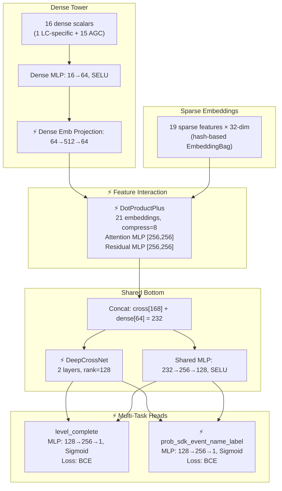

# Model Card: unified_cpe.v1_lc

| | |
|---|---|
| **Candidate** | `unified_cpe.v1_lc` (PyTorch, ads-unified-learner) |
| **Baseline (control)** | `level_complete_bhv` + `level_complete_ctx` (TensorFlow, ads-audience-pinpointer) |
| **Date** | 2026-05-05 |
| **Training data** | `unified_cpe_v1_lc` (88-day Spark-combined Parquet, ~464M rows) |
| **Offline test links** | TODO |

---

## TL;DR

- **Framework migration**: Replaces two separate TensorFlow models (`level_complete_bhv` for behavioral traffic, `level_complete_ctx` for contextual traffic) with a single unified PyTorch DLRM model that handles both traffic types.
- **Architecture upgrade**: FC MLP → DLRM with DotProductPlus cross-interaction, DeepCrossNet, and multi-task heads (level_complete + prob_sdk_event_name_label).
- **Unified traffic**: BHV (IDFA) and CTX (IDFI/unspecified) traffic trained together; `gamer_id_scope` as a sparse feature lets the model learn segment-specific behavior implicitly.
- **IBT replacement**: External TF Hub sub-models (ibt_embedding 128d + install_ibt 80d) replaced by 15 AGC dense scalar features computed offline in Spark.
- **SDK event name redesign**: Array-based per-element labels replaced with row-expansion (one row per install × target event), enabling native DLRM compatibility without custom loss logic.
- **10x data scale**: ~464M training rows (88-day window, BHV+CTX combined) vs ~46M (BHV) / ~62M (CTX) in legacy.

---

## Architecture

⚡ = NEW vs legacy

---

## Key Config Comparison

| Parameter | Legacy BHV / CTX | unified_cpe.v1_lc |
|---|---|---|
| **Framework** | TensorFlow 2.11 + Keras | PyTorch 2.x + Lightning |
| **Architecture** | FC MLP (3 layers) | DLRM (dense tower + DotProductPlus + DCN + shared bottom) |
| **Models** | 2 separate (BHV + CTX) | 1 unified |
| **Task heads** | Single (`label`) | Multi-task (`level_complete` + `prob_sdk_event_name_label`) |
| **Hidden layers** | BHV: [1024→512→256→1], CTX: [512→256→128→1] | shared_bottom [232→256→128] + per-task [128→256→1] |
| **Activation** | ELU + BatchNorm | SELU (self-normalizing, no BatchNorm) |
| **Dropout** | Input 0.05 + per-layer 0.4/0.2/0.1 | None (dropout_rate=0.0) |
| **Sparse embeddings** | Vocab-lookup, dim = 2×log2(vocab) | Hash-based, uniform dim=32 |
| **External embeddings** | IBT 128d + install_ibt 80d (TF Hub) | None (replaced by 15 AGC dense features) |
| **Batch size** | 20,000 | 25,600 |
| **Optimizer** | Adam (lr=0.003) | AdamW (lr=0.001, wd=0.05) + separate embedding AdamW (lr=0.0008) |
| **LR schedule** | ReduceLROnPlateau (patience=10) | LRPolicyScheduler (warmup 30% → steady → decay 30%) |
| **Epochs** | Max 50 (early stop patience=10) | 5 (no early stopping) |
| **Compute** | 1× T4 GPU | 8× RTX PRO 6000 Blackwell, DDP |
| **Data window** | ~60 days | 88 days |
| **Train rows** | BHV: ~46M, CTX: ~62M | ~464M (combined) |
| **Data format** | TFRecord (.gz) | Parquet (GCS) |
| **Serving format** | TF Hub SavedModel → Firestore | Triton (packed input, static shape) |
| **Gradient clipping** | clipnorm=1.0 | max_norm=1.0 |
| **Traffic scope** | BHV: IDFA-only; CTX: IDFI + unspecified | Both (IDFA + IDFI + unspecified) |

---

## Feature Engineering Changes

| Change | Legacy BHV / CTX | unified_cpe.v1_lc | What it does |
|---|---|---|---|
| **Dense features** | 13 scalar + 3 hw enriched (BHV); Apptopia + privacy flags (CTX) | 1 LC-specific + 15 AGC = 16 total | AGC replaces per-feature clipping with soft_clip+log1p; adds target_game_click_count variants |
| **gamer_creation_delay** | Disabled in BHV; normalize in CTX | soft_clip(1.5e8) → log1p | Enabled with outlier-safe transform |
| **UUPS IAP/adrev (27 features)** | Yes (BHV only) | Dropped | Monetization signals removed; tracked for Phase 2 |
| **IBT embeddings (208-dim)** | Yes (128d + 80d TF Hub sub-models) | Dropped → AGC | Eliminates external TF dependency; 15 offline-computed scalar aggregates instead |
| **Hardware stats (6 features)** | Yes (device_type enrichment) | Dropped | DeviceAtlas enrichment at serving time instead |
| **creative_id / creative_pack_id** | Not in legacy | hash=1M / hash=651k | New creative-level features |
| **device_orientation / video_orientation** | Not in legacy | hash=11 / hash=10 | New orientation features |
| **ad_format** | `ad_type` (vocab=3) | `ad_format` (hash=11) | Replaces ad_type with finer-grained format |
| **prob_sdk_event_name** | Array-based (TF RaggedTensor loss) | Scalar sparse embedding (hash=1M, list_len=1) | Row-expansion + explicit sparse feature instead of custom loss |
| **prob_sdk_event_name_label** | Per-element array loss | Dedicated BCE task head | Second task head with equal loss weight |
| **Categorical encoding** | Vocab-lookup (capped at 500) | Hash-based (fixed hash sizes) | No vocab management; handles unseen keys at cost of hash collisions |

---

## Offline Test Results

> TODO: Add offline test metric tables once evaluation runs are available.

Expected metrics for this experiment type (conversion):
- AUC
- Calibration
- NE (Normalized Entropy)
- prod AUC

| platform | id_scope | AUC | Calibration | NE |
|---|---|---|---|---|
| android | idfa | TODO | TODO | TODO |
| android | idfi | TODO | TODO | TODO |
| ios | idfa | TODO | TODO | TODO |
| ios | idfi | TODO | TODO | TODO |

---

## Key Takeaways

> TODO: Fill in after offline evaluation is complete.

Preliminary observations from data comparison reports:
- **Data scale**: 10x more training rows from unified BHV+CTX pipeline (464M vs ~108M combined legacy).
- **Label semantics differ**: Legacy label=1 is biased toward SDK-event-matched installs (35.7% positive rate). New `label` captures natural level-complete rate (~5.4% for wildcard rows, ~45% for specific-event rows).
- **Feature gaps**: UUPS IAP/adrev signals (27 features) and IBT embeddings (208-dim) are absent — these are tracked as Phase 2/3 additions and may impact performance on IAP-heavy games.
- **Broader coverage**: 13,321 distinct target games vs 1,512 in legacy (~8.8x), and IDFI/unspecified traffic now included.

---

## Infra / Deployment Notes

> TODO: Add latency and training time observations once available.

| Dimension | Legacy | unified_cpe.v1_lc |
|---|---|---|
| **Training hardware** | 1× T4 GPU | 8× RTX PRO 6000 Blackwell (DDP) |
| **Training time** | TODO | TODO |
| **Serving** | TF Hub SavedModel → Firestore | Triton (packed input, static shape, CPU) |
| **Inference latency** | TODO | TODO |
| **Datagen** | TFRecord pipeline per run | Spark batch job (88-day window, ~3h timeout) |
| **Orchestration** | Kubeflow pipeline | Metaflow workflow + Kubernetes |
| **Calibration** | N/A | Not enabled (`enable_calibration: false`) |
| **Quantization** | N/A | Unquantized (FP32, `export_fp16: false`) |
