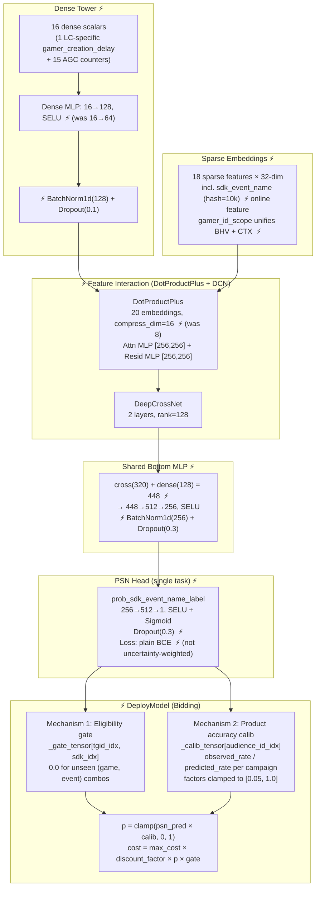

# Model Card: v11_cpe_lc

| | |
|---|---|
| **Candidate** | `unified_user_value.v11_cpe_lc` (`v11-cpe-lc-4`) |
| **Baseline (control)** | `level_complete_bhv` (`bhv1p`) + `level_complete_ctx` (`ctx1r`) (TensorFlow, ads-audience-pinpointer) |
| **Date** | 2026-06-10 |
| **Training data** | `unified_user_value_v11_cpe_lc` (60-day Spark-combined Parquet, ~504M rows, v3 dataset with `campaigns_v3` + `archived_at IS NULL`) |
| **Offline test links** | WandB artifact: `vny2xtis3e` — TODO: add eval notebook link |
| **Online A/B test** | Analysis period: 2026-05-28 → 2026-06-09 (50% traffic split) |

---

## TL;DR

- **Framework migration**: Two separate TF2 MLP models (`bhv1p` for IDFA, `ctx1r` for IDFI) replaced by a single unified PyTorch DLRM + DCN model serving all user segments.
- **Single-task PSN**: `prob_sdk_event_name_label` (P(user fires specific SDK event within 7d)) is the sole training target and serving output. The LC auxiliary head from the prior `unified_cpe.v1_lc` intermediate has been removed; plain BCE loss replaces uncertainty-weighted MultiLossModule.
- **Two serving mechanisms**: Eligibility gate (`_gate_tensor`) zeros bids for `(target_game_id, sdk_event_name)` combos never seen in training. Product accuracy calibration (`_calib_tensor`) applies per-campaign `observed_rate / predicted_rate` correction baked into the artifact — both mirror legacy `LevelCompleteCostWrapper`.
- **Wildcard remap**: `sdk_event_name=""` sent by Go serving for wildcard campaigns is remapped from `UNKNOWN_INT` → `"*"` vocab index so wildcard campaigns are correctly gated and embedded.
- **Strong online results**: Net Revenue +99.4% on Level Complete traffic; all-traffic Net Revenue +0.71% (CI: +0.15%, +1.29%, statistically significant). Near-zero product bias on target events (−2% at D3) vs. legacy control's chronic −23% underspend.

---

## Architecture

⚡ = NEW vs legacy TF2 BHV/CTX models

---

## Key Config Comparison

| Parameter | Legacy BHV / CTX | `unified_cpe.v1_lc` (prior) | `v11_cpe_lc` (this card) |
|---|---|---|---|
| **Framework** | TensorFlow 2.11 | PyTorch 2.x | PyTorch 2.x |
| **Architecture** | FC MLP (3 layers) | DLRM + DCN | DLRM + DCN |
| **Task heads** | Single (`label`) | PSN (main) + LC auxiliary | PSN only — LC head removed |
| **Loss** | BCE | Uncertainty-weighted MultiLossModule | Plain BCE (single task) |
| **dense_tower_mlp** | — | `[16, 64]` | `[16, 128]` |
| **dot_product_compress_dim** | — | `8` | `16` |
| **shared_bottom_mlp** | — | `[232, 256, 128]` | `[448, 512, 256]` |
| **BatchNorm + Dropout** | BN + 0.4/0.2/0.1 | None (SELU only) | BN + D(0.1) dense; BN + D(0.3) shared bottom; D(0.3) PSN head |
| **sdk_event_name feature** | N/A | Offline-only (`prob_sdk_event_name`) | **Online sparse** (hash=10k, populated by Go serving) |
| **Eligibility gate** | `trained_game_sdk_combo_multipliers` (legacy) | None | `_gate_tensor[tgid, sdk_event]` — mirrors legacy Mechanism 1 |
| **Product accuracy calib** | `LevelCompleteCostWrapper` (legacy) | None | `_calib_tensor[audience_id]` — mirrors legacy Mechanism 2 |
| **Wildcard remap** | `sdk_event_name_default = "*"` (legacy) | None | `UNKNOWN_INT (5)` → `"*"` vocab index in `forward()` |
| **lr_scheduler.total_step** | N/A | Hardcoded to `88` (bug) | Computed dynamically from BQ `COUNT(*)` at training time |
| **Workflow step** | — | `run_datagen → ... → model_deploy` | Added `refresh_calibration` before `model_deploy` |
| **model_variant** | — | `3` | `4` |
| **Compute** | 1× T4 GPU | 8× RTX PRO 6000 Blackwell DDP | 8× RTX PRO 6000 Blackwell DDP |
| **Serving** | TF Hub SavedModel | Triton CPU | Triton CPU |
| **Training rows** | BHV: ~44M, CTX: ~60M | ~505M (v0 dataset, wildcard-inflated) | ~107M (v3 dataset, `archived_at IS NULL`) |

---

## Feature Engineering Changes

| Change | Legacy BHV / CTX | v11_cpe_lc | What it does |
|---|---|---|---|
| **sdk_event_name** | Not an online feature | Online sparse embedding (hash=10k, `list_len=1`) | Go serving populates from `campaign.SdkEventNames[0]`; DLRM learns per-event signal independently from `target_game_id` |
| **prob_sdk_event_name** | Array-based ragged label | Offline-only sparse (hash=1M) — `{target_game_id}_{event_name}` | Moved to offline-only; online serving uses `sdk_event_name` directly |
| **model_name** | Not applicable | Offline-only sparse | Not populated by Go serving; training signal only |
| **gamer_creation_delay** | Disabled (BHV) / normalized (CTX) | `soft_clip(1.5e8)` → `log1p` (online + offline) | Enabled with outlier-safe transform across unified model |
| **IBT embeddings (208-dim)** | Yes (TF Hub sub-models) | Dropped | Eliminated external TF Hub dependency; 15 AGC dense features replace |
| **UUPS IAP/adrev (27 features)** | Yes (BHV only) | Dropped (Phase 2) | High-priority addition tracked for next iteration |
| **gamer_id_scope** | Separate BHV / CTX models | Sparse embedding (hash=12) | Single model handles IDFA + IDFI + unspecified by conditioning on scope |
| **ad_format** | Not in legacy | Sparse (hash=11) | Interstitial vs. rewarded ad type signal |
| **creative_id / creative_pack_id** | Not in legacy | hash=1M / hash=651k | Creative-level signals |
| **device_orientation / video_orientation** | Not in legacy | hash=11 / hash=10 | Creative orientation context |

---

## Offline Test Results

Evaluation on 60-day dataset (install dates 2026-02-26 → 2026-04-26, ~486M train / ~18.7M val rows). Artifact: `vny2xtis3e`, epoch 5.

> **Note on comparability**: Direct loss comparison across new and legacy models is not valid — different label definitions (CPE ~19.75% positive vs. CPI ~37%), different loss formulations (single-task BCE vs. uncertainty-weighted multi-task), and train vs. val differences. AUC and NE are the most meaningful cross-model signals. The v11_cpe_lc metrics below are train-set only; separate held-out time-based val metrics are pending.

| Metric | v11_cpe_lc (train, epoch 5) | Legacy BHV (val, best epoch) | Legacy CTX (val, best epoch) |
|---|---|---|---|
| AUC | **0.9483** | 0.8997 | 0.8991 |
| BCE | **0.2047** | 0.3308 | 0.3313 |
| NE (window) | **0.4119** | ~0.505 | ~0.506 |
| Calibration ratio | **0.9993** | — | — |
| mean_pred | 0.1976 | 0.2494 (bias=0.0025) | 0.2512 (bias=0.0031) |
| mean_label | 0.1975 | — | — |
| Prediction bias (abs) | **< 0.0001** | 0.0025 | 0.0031 |

### Key Takeaways

- **+5.4pp AUC** vs. legacy (0.9483 vs ~0.90). Near-perfect calibration on training data (ratio 0.9993, mean_pred − mean_label < 0.0001).
- **NE 0.41** vs. ~0.51 legacy — model beats the base rate significantly better than legacy.
- Known limitation: LR schedule bug (`total_step=88` instead of ~23,719) caused dense-layer LR to decay after ~0.4% of training in the first run. Fixed via dynamic BQ `COUNT(*)` computation in `workflow.py`. Subsequent runs train correctly.

---

## Online A/B Test Results

**Setup**: `v11-cpe-lc-4` at 50% vs. combined `bhv1p + ctx1r` at 50%. Analysis period: 2026-05-28 → 2026-06-09.

### Scale — All Traffic (Statsig / DI Business Metrics)

| Metric | Lift | 95% CI | |
|---|---|---|---|
| Impressions | +0.14% | (+0.08%, +0.20%) | ✅ |
| Clicks | +0.13% | (+0.04%, +0.22%) | ✅ |
| Installs | −0.11% | (−0.17%, −0.05%) | ⚠ Expected (higher-CPE campaign mix) |
| Publisher Revenue | +0.30% | (+0.23%, +0.37%) | ✅ |
| Advertiser Spend | +0.44% | (+0.23%, +0.66%) | ✅ |
| **Net Revenue** | **+0.71%** | **(+0.15%, +1.29%)** | ✅ **Significant** |

### Scale — Level Complete Traffic Only (normalized to 100%)

| Metric | Control (bhv1p + ctx1r) | Test (v11-cpe-lc) | Delta |
|---|---|---|---|
| Starts | 112,344,030 | 144,719,720 | **+28.8%** |
| Installs | 531,098 | 768,770 | **+44.8%** |
| Spend | $742,042 | $1,305,386 | **+75.9%** |
| **Net Revenue** | $270,153 | **$538,731** | **+99.4%** |
| eCPI | $1.40 | $1.70 | +21.5% (expected — higher-CPE mix) |

### Post-Install Quality (D0–D7)

| Signal | Control | Test | Verdict |
|---|---|---|---|
| Model bias D0 (any event) | −19.0% | **−11.7%** | ✅ 38% less biased |
| Model bias D7 (any event) | −24.6% | **−17.7%** | ✅ Better calibrated |
| Product bias D3 (target event) | −0.23 | **−0.02** | ✅ Near parity (legacy chronically underspends) |
| Product bias D7 (target event) | −0.18 | **+0.05** | ✅ At target CPE |
| LC rate per install (any event, D7) | 36.35% | 31.01% | ⚠ Lower per-install — expected composition effect; absolute LC volume +40% |

> **Headline result**: Near-zero product bias on target events (−2% at D3, +5% at D7) vs. legacy control's persistent underspend (−23% at D3, −18% at D7). Advertisers receive the exact events they targeted at the price they set — the primary quality objective for CPE Level Complete.

---

## Infra / Deployment Notes

| Dimension | Legacy BHV + CTX | v11_cpe_lc |
|---|---|---|
| **Training hardware** | 1× T4 GPU | 8× RTX PRO 6000 Blackwell (DDP) |
| **Serving format** | TF Hub SavedModel → Firestore | Triton (packed input, static shape, CPU) |
| **Deploy nodepool** | N/A | `cpu-n4-highmem-8` |
| **Datagen** | TFRecord pipeline | Spark batch job (~8h, 60-day window, 3,520 partitions) |
| **Orchestration** | 2× Kubeflow pipelines | 1× Metaflow workflow (Vertex AI), cron `0 21 * * *` |
| **Calibration artifacts** | `LevelCompleteCostWrapper` (runtime) | `product_accuracy_calibration.json` baked into artifact at deploy; refreshed daily via `refresh_calibration` step (14-day lookback) |
| **Eligibility gate** | `trained_game_sdk_combo_multipliers` (runtime) | `trained_game_sdk_combo.json` baked into `_gate_tensor` at deploy; refreshed on each training run via `update_mappings` step |
| **Quantization** | N/A | Unquantized (FP32, `export_fp16: false`) |
| **Gradient clipping** | clipnorm=1.0 | max_norm=1.0 |
| **Model params** | ~2M (FC MLP) | ~36.3M total (35.3M sparse embeddings + 1.0M dense) |

